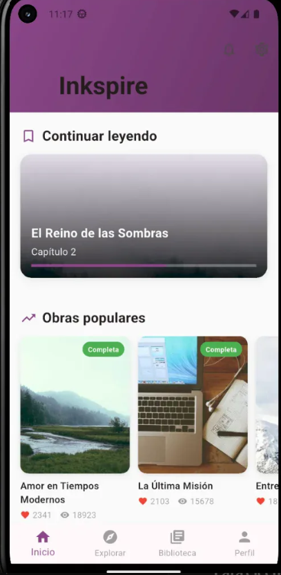

# 📚 Inkspire - Aplicación Móvil de Lectura y Escritura


Inkspire es una aplicación móvil desarrollada en Flutter que permite a los usuarios leer, escribir y compartir obras literarias en una comunidad interactiva.

## ✨ Características

- 📖 Lectura de obras literarias por capítulos
- ✍️ Publicación de obras propias
- 🔍 Sistema de búsqueda y exploración por géneros
- 📚 Biblioteca personal con seguimiento de lectura
- 👤 Perfiles de autor con estadísticas
- 💬 Feed social con publicaciones e interacciones
- 🌓 Soporte para modo claro y oscuro

## 📱 Capturas de Pantalla

| Inicio | Explorar | Biblioteca | Perfil |
|--------|----------|------------|--------|
|  |  |  |  |

## 🛠️ Requisitos del Sistema

### Para desarrollo:
- Flutter SDK 3.24 o superior
- Dart SDK 3.5 o superior
- Android Studio / VS Code con extensiones de Flutter
- Git

### Para ejecución:
- **Android**: Android 6.0 (API 23) o superior
- **iOS**: iOS 12.0 o superior (requiere Xcode en macOS)

## 🚀 Instalación

### 1. Clonar el repositorio

```bash
git clone https://github.com/BrayanM31/Inkspire.git
cd Inkspire
```

### 2. Instalar dependencias

```bash
flutter pub get
```

### 3. Verificar instalación de Flutter

```bash
flutter doctor
```

Asegúrate de que todos los checks estén en verde (✓). Si aparecen problemas, sigue las instrucciones que te proporciona el comando.

### 4. Ejecutar la aplicación

#### En Android:

**Opción A - Emulador:**
1. Abre Android Studio
2. Ve a `Tools > Device Manager`
3. Crea o inicia un emulador
4. Ejecuta:
```bash
flutter run
```

**Opción B - Dispositivo físico:**
1. Activa las opciones de desarrollador en tu Android
2. Activa la depuración USB
3. Conecta tu dispositivo por USB
4. Ejecuta:
```bash
flutter run
```

#### En Chrome (para pruebas rápidas):

```bash
flutter run -d chrome
```

## 📁 Estructura del Proyecto

```
inkspire/
├── lib/
│   ├── main.dart                    # Punto de entrada
│   ├── models/                      # Modelos de datos
│   │   ├── user.dart
│   │   ├── work.dart
│   │   ├── chapter.dart
│   │   ├── post.dart
│   │   └── comment.dart
│   ├── data/                        # Datos mock
│   │   └── mock_data.dart
│   └── screen/                      # Pantallas
│       ├── main_navigation.dart
│       ├── home_screen.dart
│       ├── explore_screen.dart
│       ├── library_screen.dart
│       └── profile_screen.dart
├── android/                         # Configuración Android
├── ios/                            # Configuración iOS
├── pubspec.yaml                    # Dependencias
└── README.md
```

## 🎨 Tecnologías Utilizadas

- **Framework**: Flutter 3.24
- **Lenguaje**: Dart 3.5
- **Arquitectura**: Modelo-Vista (MV) simple
- **Gestión de estado**: StatefulWidget
- **UI/UX**: Material Design 3
- **Navegación**: BottomNavigationBar + Routes

## 📦 Dependencias Principales

```yaml
dependencies:
  flutter:
    sdk: flutter
  # Actualmente usando solo dependencias core de Flutter
  # Próximamente: provider, http, sqflite
```

## 🔧 Comandos Útiles

### Limpiar proyecto
```bash
flutter clean
flutter pub get
```

### Compilar APK (Android)
```bash
flutter build apk --release
```

### Compilar para iOS
```bash
flutter build ios --release
```

### Ejecutar tests
```bash
flutter test
```

### Analizar código
```bash
flutter analyze
```

## 🐛 Solución de Problemas

### Error: "Flutter SDK not found"
```bash
# Verifica que Flutter esté en el PATH
flutter --version
```

### Error: "No devices found"
```bash
# Lista dispositivos disponibles
flutter devices

# Si no aparece tu emulador/dispositivo, revisa:
# - Emulador iniciado (Android Studio)
# - USB debugging activado (dispositivo físico)
# - Drivers instalados (Windows)
```

### Error: Gradle build failed (Android)
```bash
cd android
./gradlew clean
cd ..
flutter clean
flutter pub get
flutter run
```

### Las imágenes no cargan
- Verifica que el emulador/dispositivo tenga conexión a internet
- Las URLs de `pravatar.cc` y `picsum.photos` requieren internet

## 📝 Estado Actual del Proyecto

**Fase 1 - COMPLETADA** ✅
- [x] Arquitectura base
- [x] Modelos de datos
- [x] Sistema de navegación
- [x] Pantalla de Inicio
- [x] Pantalla de Explorar
- [x] Pantalla de Biblioteca
- [x] Pantalla de Perfil
- [x] Datos mock funcionales
- [x] UI/UX completo

**Fase 2 - PRÓXIMAMENTE** 🚧
- [ ] Autenticación de usuarios
- [ ] Backend con Firebase/API REST
- [ ] Lectura de capítulos completos
- [ ] Sistema de likes/comentarios funcional
- [ ] Escritura y publicación de obras
- [ ] Persistencia local con SQLite
- [ ] Notificaciones push

## 👨‍💻 Autor

**Brayan M31**
- GitHub: [@BrayanM31](https://github.com/BrayanM31)

## 📄 Documentación Adicional

- [Informe del Proyecto](INFORME.md)
- [Flutter Documentation](https://docs.flutter.dev)
- [Dart Language Tour](https://dart.dev/guides/language/language-tour)

## 📧 Contacto

Para preguntas o sugerencias sobre el proyecto:
- **Email**: [tu-email@ejemplo.com]
- **GitHub Issues**: [Issues del repositorio](https://github.com/BrayanM31/Inkspire/issues)

---

**Desarrollado como proyecto académico - Aplicaciones Móviles 2025-B**

*⭐ Si te gusta el proyecto, dale una estrella en GitHub*
